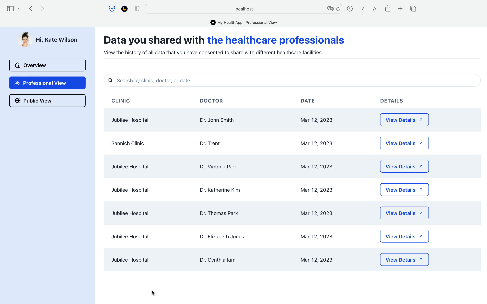

# MedMate - A system for Patients to Access and Control Their Health Records

## About the Project
This is an app developed for the #islandHealth Code Hack 2023 event. 
Within 24 hours, we developed a system facilitating all doctors and patients interactions with a central health database.
The system includes:
1. A web app (current repo) for patients to view and control their own health records.
2. A cross-flatform app (currently designed for iPad) (separate repo) for doctors to write to the health database.
3. A webpage (separate [repo](https://github.com/julhoang/code_hack_QR)) to show a person's public info in case of emergency. 

Please note that the simulated health database has been taken down after the event. The sample API response from the server can be found in `src/utils/sampleServerResponse.json`

 

---
## Developer Team
- 👩‍💻 [Julia Hoang](https://github.com/julhoang)
- 🧑‍💻 [Matthew Trent](https://github.com/mattrltrent)
- 🧑‍💻 [Christopher Huk](https://github.com/TalentedB)
  

 

---
## Screenshots
### Overview Page
This is where the patients can view and access all of their health data. 

### Professional Page
This is where the patients can view past doctors visit.

### Public Page
This is where the patients can manage their public profile

